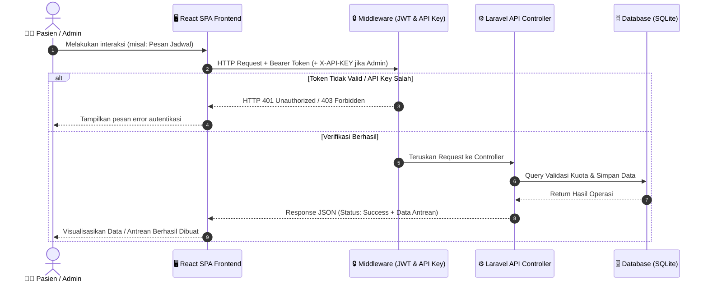
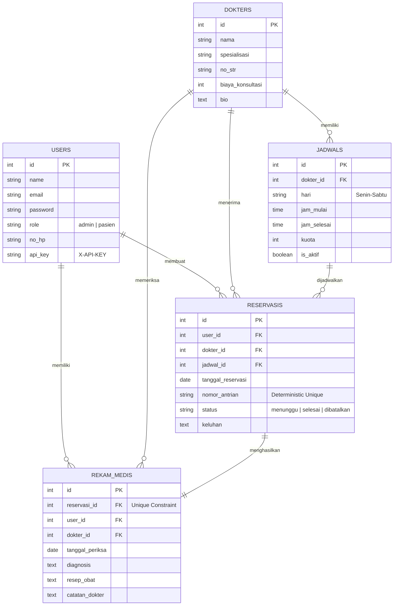

# 🏥 Sistem Informasi Manajemen Klinik Sehat
### Aplikasi Web Terintegrasi Booking Reservasi Antrean & Rekam Medis Pasien

> [!NOTE]  
> Dokumentasi ini disusun sebagai laporan teknis proyek kelompok pengerjaan tugas akademik/praktikum mata kuliah Pemrograman API.

---

## 👥 Informasi Kelompok & Pengembang

| No | Nama Lengkap | NIM |
|---|---|---|
| 1 | **Elia Rifana Rif'an** | **24091397139** | 
| 2 | **Ica thalita Natania** | **24091397158** | 
| 3 | **Khildan Ash Kahfi** | **24091397159** | 
---

## 📌 1. Deskripsi Proyek
**Klinik Sehat** adalah sebuah platform digital berbasis web terintegrasi yang dirancang untuk mengatasi inefisiensi pada sistem layanan kesehatan konvensional, khususnya dalam hal **antrean janji temu (booking)** dan **pencatatan data medis (rekam medis)**. 

Aplikasi ini mengadopsi arsitektur *decoupled* yang memisahkan antara **RESTful API Backend (Laravel 12)** dengan **Frontend Client SPA (React 19 & Vite)**. Melalui pemisahan ini, sistem memiliki skalabilitas tinggi, kinerja responsif, dan keamanan akses data terjamin.

### 🌟 Fitur Unggulan
1. **Autentikasi Terenkripsi (JWT)**: Login dan pendaftaran pasien aman menggunakan *JSON Web Token*.
2. **Sistem Antrean & Reservasi Terintegrasi**: Pengecekan sisa kuota harian dokter secara *real-time* sebelum reservasi dibuat guna menghindari *double booking*.
3. **Double-Layer Security Admin**: Akses administratif khusus dibatasi melalui verifikasi JWT token dan validasi custom header `X-API-KEY`.
4. **Modul Rekam Medis Otomatis**: Transisi otomatis status reservasi dari `"menunggu"` menjadi `"selesai"` sesaat setelah dokter/admin menginput data hasil pemeriksaan medis.
5. **Dashboard Analytics & Chart**: Visualisasi interaktif grafik statistik kunjungan pasien harian dan proporsi status reservasi menggunakan chart modern (Recharts).

---

## 🏗️ 2. Arsitektur Sistem

Sistem dirancang menggunakan konsep arsitektur **Three-Tier** terdistribusi:
1. **Presentation Layer (React 19 SPA)**: Antarmuka dinamis dengan CSS kustom berkecepatan tinggi berbasis bundler Vite.
2. **Application Layer (Laravel 12 REST API)**: Logika bisnis, validasi request, scheduling filter, and rate limiter.
3. **Data Layer (SQLite Database)**: Penyimpanan data relasional portabel dan siap uji tanpa konfigurasi rumit.

### 🔄 Alur Komunikasi Request (Mermaid Diagram)



---

## 📊 3. Desain Model Data & Relasi Database

Aplikasi menggunakan struktur database relasional yang dinormalisasi dengan relasi sebagai berikut:



### ⚡ Strategi Optimasi Performa Database (Database Indexing)
Untuk memastikan query tetap optimal ketika jumlah data meningkat drastis (*high-scale data environment*), indeks khusus diimplementasikan melalui migrasi database pada kolom-kolom yang sering digunakan dalam klausa `WHERE`, `ORDER BY`, dan `JOIN`:

1. **`users.api_key`**: Diindeks secara khusus untuk pencarian instan $O(1)$ setiap kali melakukan verifikasi API Key admin di tingkat middleware.
2. **`reservasis.status` & `reservasis.tanggal_reservasi`**: Diindeks guna mempercepat kalkulasi kuota harian dokter dan menentukan urutan nomor antrean berikutnya.
3. **`jadwals.is_aktif`**: Mempercepat proses filtering jadwal praktik dokter yang aktif untuk disajikan kepada calon pasien di frontend.
4. **`rekam_medis.tanggal_periksa`**: Mempercepat load riwayat klinis pasien yang diurutkan secara kronologis terbalik (*latest first*).

---

## 🔒 4. Keamanan & Logika Bisnis Tingkat Tinggi

Sistem ini menerapkan standar keamanan terintegrasi dan validasi ketat guna menjaga integritas data:

*   **Double-Layer Administrative Security**:
    Semua rute perubahan data dokter, pembuatan jadwal, dan penulisan rekam medis tidak hanya dilindungi oleh filter otorisasi peran (*Role-Based Access Control*), tetapi juga memerlukan header **`X-API-KEY`** yang harus dikirimkan bersama token JWT.
*   **Idempotency & Validasi Jadwal**:
    Saat pasien memesan antrean, sistem melakukan pengecekan lintas hari. Sistem memvalidasi apakah hari pada tanggal janji temu (contoh: `2026-06-10` adalah hari Rabu) sesuai dengan hari operasional pada detail jadwal dokter bersangkutan.
*   **Penomoran Antrean Dinamis**:
    Nomor antrean dibuat secara terstruktur dengan format `YYMMDD-J{jadwal_id}-{urutan_antrean}` (Contoh: `260610-J2-03`). Hal ini menjamin nomor antrean bersifat unik, informatif, dan tidak tumpang tindih.
*   **Perlindungan DoS pada Pagination**:
    Melalui `PaginationHelper`, query parameter `per_page` dibatasi secara dinamis menggunakan fungsi limit `max(1, min($perPage, 50))`. Hal ini mencegah penyerang melakukan request payload besar seperti `?per_page=999999` yang berpotensi membebani memori server database.
*   **Rate Limiting API**:
    Rute pendaftaran akun baru (`auth/register`) dan login (`auth/login`) diberi pembatas laju request (*throttling*) guna mengamankan sistem dari serangan *Brute Force*.

---

## 📖 5. Dokumentasi API (Swagger / OpenAPI 3.0)

Proyek ini telah dilengkapi dengan dokumentasi RESTful API terstandarisasi yang dibuat menggunakan anotasi OpenAPI 3.0 via library `darkaonline/l5-swagger`.

*   **Akses UI Dokumentasi**: `http://localhost:8080/api/klinik`
*   **Perintah Regenerasi Swagger Docs** (jika ada perubahan anotasi pada Controller):
    ```bash
    php artisan l5-swagger:generate
    ```

---

## ⚙️ 6. Cara Instalasi & Menjalankan Proyek

Sistem ini telah dikonfigurasi untuk dijalankan dengan sangat mudah melalui skrip otomasi terpadu.

### 📋 Prasyarat Sistem
Pastikan perangkat komputer Anda telah terinstal:
*   **PHP** >= 8.2 (dilengkapi ekstensi SQLite & PDO)
*   **Composer** (Manajer dependensi PHP)
*   **Node.js** >= 18 & **NPM**

### 🚀 Panduan Setup Singkat (Single-Command)

Ikuti langkah-langkah berikut di terminal Anda:

1. **Instalasi & Inisialisasi Otomatis**:
   Cukup jalankan satu perintah berikut di direktori utama proyek:
   ```bash
   composer run setup
   ```
   *Skrip ini secara otomatis akan menginstal dependensi PHP (Composer), membuat file `.env` lokal, membuat file database SQLite, melakukan migrasi database beserta pengisian data seeder, menginstal dependensi Node.js, dan melakukan build aset frontend.*

2. **Jalankan Server Pengembangan (Dev Server)**:
   Untuk menjalankan backend server dan frontend React secara bersamaan dalam satu terminal, jalankan perintah:
   ```bash
   composer run dev
   ```
   *Perintah ini menggunakan `npx concurrently` untuk mengeksekusi:*
   *   **Laravel Local Server** (pada `http://127.0.0.1:8000`)
   *   **React Dev Server (Vite)** (pada `http://localhost:5173`)
   *   **Laravel Background Queue Listener** (untuk memproses notifikasi antrean)
   *   **Laravel Pail** (untuk memantau log secara real-time langsung di terminal)

3. **Uji Coba Pengujian Unit (Testing Suite)**:
   Untuk memverifikasi fungsionalitas sistem berjalan dengan benar:
   ```bash
   composer run test
   ```

---

## 🔑 7. Akun Demo untuk Pengujian Dosen

Saat mempresentasikan aplikasi kepada dosen penguji, gunakan kredensial bawaan berikut yang telah di-seed ke dalam database:

### 👤 1. Akses Role: ADMINISTRATOR / DOKTER
*   **Email**: `admin@klinik.com`
*   **Password**: `admin123`
*   **API Key (Header `X-API-KEY`)**: Di-generate otomatis (dapat dilihat di respons login atau di database).

### 👥 2. Akses Role: PASIEN (Demo)
*   **Email**: `budi@example.com` atau `siti@example.com`
*   **Password**: `password`

---
